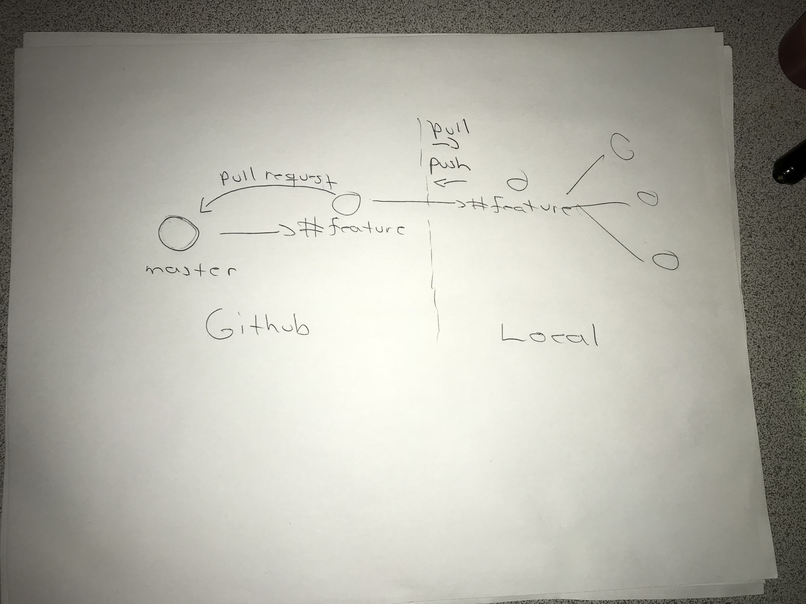
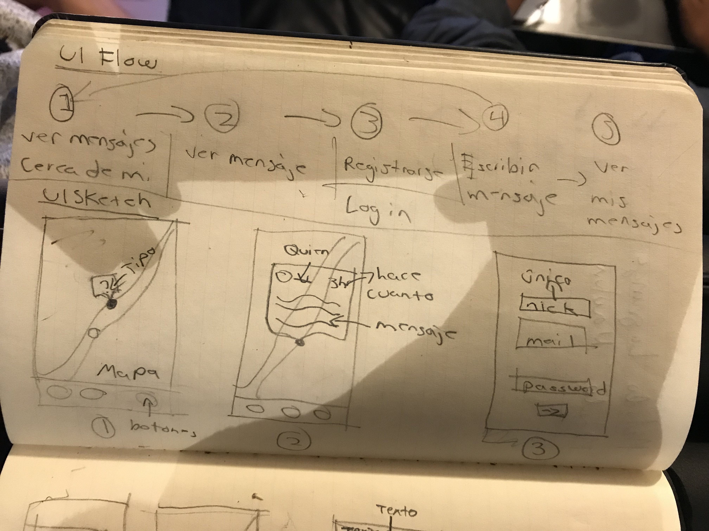
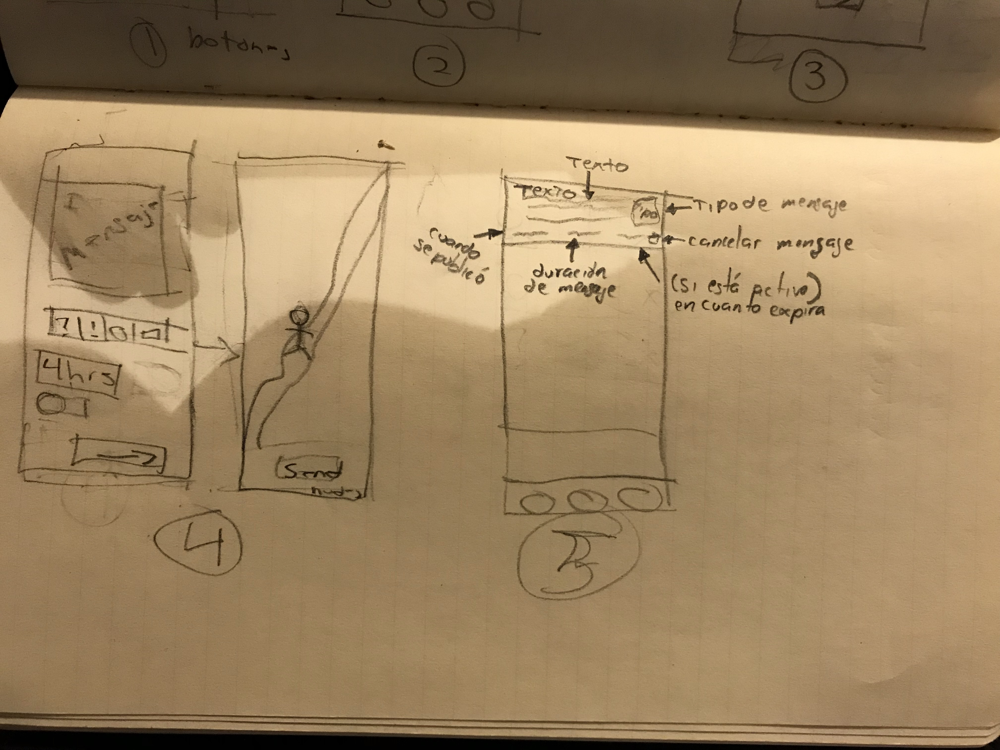

# NodeGeoMsg

GeoMsg es una plataforma móvil, en la cual se le permite al usuario A dejar un mensaje en una posición georeferenciada, para que cuando un usuario B se encuentra dentro de un radio pre-establecido del mensaje, éste pueda visualizarlo. Los mensajes tendrán diferentes características, como un tiempo de duración limitada y un tipo.

El objetivo de este proyecto, es poder comunicarte con tu entorno, de una manera digital, reduciendo cualquier desperdicio o daño a una propiedad.

# Installation

```
$ mongo
> use geomsg

cd temp

$ npm install
$ npm start
```

## Database

### User Collection
```
$ mongo
> use geomsg
> db.createCollection("User")
```

# Collaboration

## Branches

master: código funcionando
branch por feature: desarrollo

## Collaboration

* Commits on english
* Variables on snake_case
* Classes on PascalCase
* Functions on camelCase

## Workflow



## Mockups



